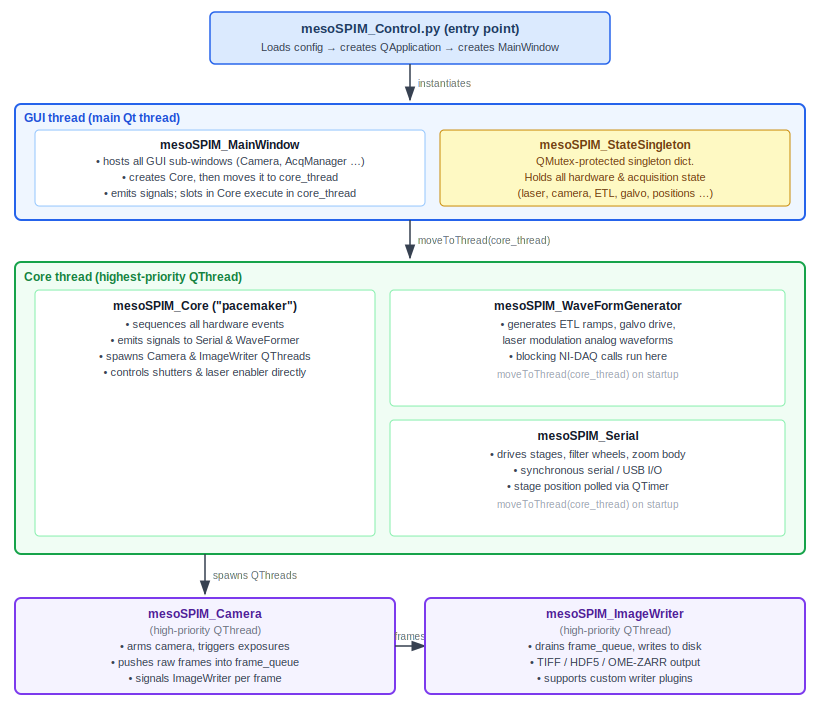

API Reference
=============

Auto-generated API documentation from source docstrings.

Architecture Overview
---------------------

mesoSPIM-control is a **PyQt5 application** built around a strict thread-safety model.
All inter-component communication goes through **Qt signals and slots** (using
``QueuedConnection`` so that callers never block the GUI event loop).  The diagram
below shows how the major pieces fit together:

Key architectural concepts
~~~~~~~~~~~~~~~~~~~~~~~~~~

**mesoSPIM_StateSingleton** (``src/mesoSPIM_State.py``)
    A mutex-protected singleton dictionary that stores the complete hardware and
    acquisition state: laser selection, camera exposure, stage positions, ETL/galvo
    parameters, current acquisition list, and more.  All threads read and write
    state through this object using ``QMutex`` for thread safety.

**mesoSPIM_Core** (``src/mesoSPIM_Core.py``)
    The orchestration layer — described in its own docstring as *"the pacemaker of a
    mesoSPIM"*.  It does not perform hardware I/O itself; instead it emits signals to
    the worker threads in the correct order and waits for their acknowledgement via
    ``BlockingQueuedConnection`` when synchronisation is required.

**Worker threads**
    Only two worker objects run on dedicated ``QThread`` instances:

    * ``mesoSPIM_Camera`` — arms the camera, triggers exposures, and pushes raw
      frames into a shared ``deque`` (``frame_queue``).
    * ``mesoSPIM_ImageWriter`` — consumes ``frame_queue`` and writes files; supports
      a plugin API (``src/plugins/ImageWriterApi.py``) for custom output formats.

    ``mesoSPIM_WaveFormGenerator`` and ``mesoSPIM_Serial`` both live in the **Core
    thread** alongside ``mesoSPIM_Core`` itself.  The waveformer performs blocking
    NI-DAQ calls, and the serial worker performs synchronous serial/USB calls, both
    within the Core event loop.  (A ``BlockingQueuedConnection`` from Core to either
    of those workers would deadlock, which is why ``QueuedConnection`` is used
    throughout.)

**Device abstraction** (``src/devices/``)
    Every hardware class has a ``Demo_*`` counterpart that simulates the device in
    software.  The correct class is selected at runtime from the config file, so the
    full acquisition pipeline can be exercised without physical hardware.

**GUI sub-windows** (``src/mesoSPIM_*Window.py``)
    Thin PyQt5 views wired to MainWindow signals.  They never touch hardware
    directly — all user actions are translated into signal emissions that travel to
    Core and then onwards to the appropriate worker.

**Configuration files** (``config/*.py``)
    Plain Python modules imported at startup.  A configuration file declares
    dictionaries (``camera_parameters``, ``stage_parameters``, ``laser_parameters``,
    etc.) that Core and the device classes read to select hardware drivers and
    calibration values.

**Plugin system** (``src/plugins/``)
    mesoSPIM currently supports two plugin families: image writers and image
    processors. Writers extend acquisition output formats through
    ``ImageWriterApi``. Processors extend the live and acquisition pipeline
    through ``ImageProcessorApi`` and the processor chain. Both are discovered
    through ``PluginRegistry``.

    See :doc:`../plugins` for the author guide.

Core modules
------------

mesoSPIM_Core
~~~~~~~~~~~~~

.. automodule:: mesoSPIM.src.mesoSPIM_Core
   :members:
   :undoc-members:
   :show-inheritance:

mesoSPIM_State
~~~~~~~~~~~~~~

.. automodule:: mesoSPIM.src.mesoSPIM_State
   :members:
   :undoc-members:
   :show-inheritance:

mesoSPIM_Camera
~~~~~~~~~~~~~~~

.. automodule:: mesoSPIM.src.mesoSPIM_Camera
   :members:
   :undoc-members:
   :show-inheritance:

mesoSPIM_Stages
~~~~~~~~~~~~~~~

.. automodule:: mesoSPIM.src.mesoSPIM_Stages
   :members:
   :undoc-members:
   :show-inheritance:

mesoSPIM_ImageWriter
~~~~~~~~~~~~~~~~~~~~~

.. automodule:: mesoSPIM.src.mesoSPIM_ImageWriter
   :members:
   :undoc-members:
   :show-inheritance:

mesoSPIM_WaveFormGenerator
~~~~~~~~~~~~~~~~~~~~~~~~~~~

.. automodule:: mesoSPIM.src.mesoSPIM_WaveFormGenerator
   :members:
   :undoc-members:
   :show-inheritance:

mesoSPIM_Serial
~~~~~~~~~~~~~~~

.. automodule:: mesoSPIM.src.mesoSPIM_Serial
   :members:
   :undoc-members:
   :show-inheritance:

mesoSPIM_Zoom
~~~~~~~~~~~~~

.. automodule:: mesoSPIM.src.mesoSPIM_Zoom
   :members:
   :undoc-members:
   :show-inheritance:

mesoSPIM_Optimizer
~~~~~~~~~~~~~~~~~~

.. automodule:: mesoSPIM.src.mesoSPIM_Optimizer
   :members:
   :undoc-members:
   :show-inheritance:

GUI windows
-----------

mesoSPIM_MainWindow
~~~~~~~~~~~~~~~~~~~~

.. automodule:: mesoSPIM.src.mesoSPIM_MainWindow
   :members:
   :undoc-members:
   :show-inheritance:

mesoSPIM_AcquisitionManagerWindow
~~~~~~~~~~~~~~~~~~~~~~~~~~~~~~~~~~~

.. automodule:: mesoSPIM.src.mesoSPIM_AcquisitionManagerWindow
   :members:
   :undoc-members:
   :show-inheritance:

mesoSPIM_CameraWindow
~~~~~~~~~~~~~~~~~~~~~

.. automodule:: mesoSPIM.src.mesoSPIM_CameraWindow
   :members:
   :undoc-members:
   :show-inheritance:

Devices
-------

Cameras
~~~~~~~

.. automodule:: mesoSPIM.src.devices.cameras.Demo_Camera
   :members:
   :undoc-members:
   :show-inheritance:

Filter wheels
~~~~~~~~~~~~~

.. automodule:: mesoSPIM.src.devices.filter_wheels.mesoSPIM_FilterWheel
   :members:
   :undoc-members:
   :show-inheritance:

Lasers
~~~~~~

.. automodule:: mesoSPIM.src.devices.lasers.mesoSPIM_LaserEnabler
   :members:
   :undoc-members:
   :show-inheritance:

Shutters
~~~~~~~~

.. automodule:: mesoSPIM.src.devices.shutters.NI_Shutter
   :members:
   :undoc-members:
   :show-inheritance:

Utilities
---------

.. automodule:: mesoSPIM.src.utils.acquisitions
   :members:
   :undoc-members:
   :show-inheritance:

.. automodule:: mesoSPIM.src.utils.utility_functions
   :members:
   :undoc-members:
   :show-inheritance:
