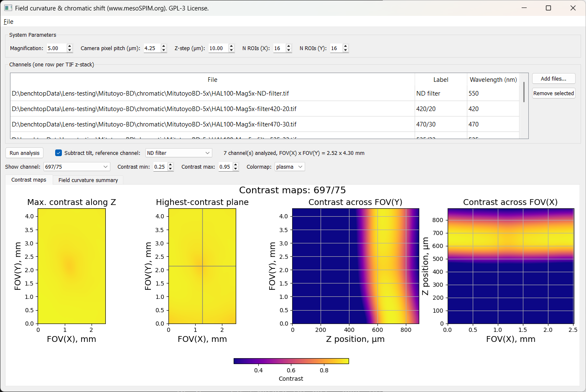
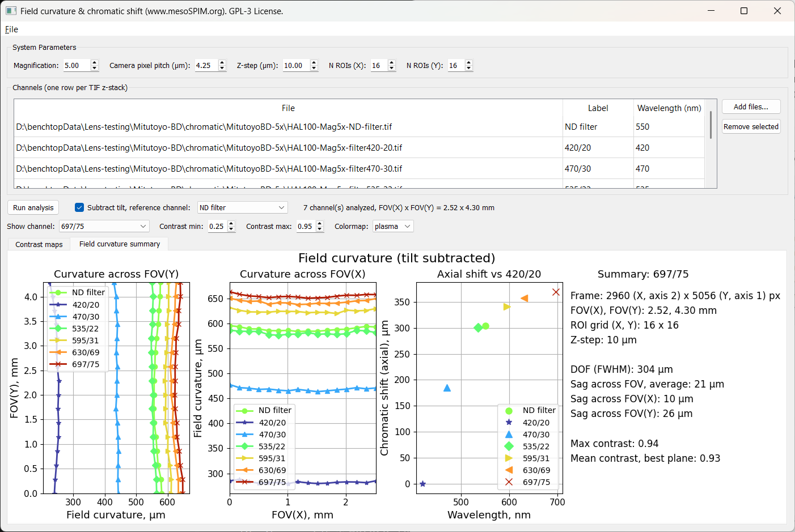

Field Curvature & Chromatic Shift
==================================

The **Field curvature & chromatic shift** tool measures how the plane of best
focus varies across the field of view, and how it shifts with wavelength. It
divides each frame of a z-stack into a grid of ROIs, computes the image
contrast of every ROI at every z-plane, and derives the depth of field, the
field curvature sag across X and Y, and — for a multi-channel measurement —
the axial chromatic shift.

It works on a single z-stack (monochromatic) or on several stacks acquired
through different bandpass filters (polychromatic), one stack per channel.

The tool ships as a single, self-contained module
(``mesoSPIM/src/utils/field_curvature_gui_qt.py``) and can be launched either
from inside mesoSPIM-control or as a standalone application.

   **Contrast maps** tab: system parameters and the channel table (top), then
   the four contrast panels for the selected channel — maximum contrast along
   Z, the highest-contrast plane, and axial sections through the centre of the
   field along Y and along X.

Sample preparation
--------------------

The measurement needs a **periodic, high-contrast test target** imaged in
transmission — a Ronchi grating (e.g. 40 line pairs/mm) is the usual choice.
Acquire a z-stack through focus, with the stack range comfortably wider than
the expected field curvature so that the contrast peak is bracketed at every
field position.

For a chromatic measurement, acquire one stack per bandpass filter **without
moving the sample between stacks** — the axial shift between channels is the
quantity being measured.

Launching the tool
-------------------

From mesoSPIM-control
~~~~~~~~~~~~~~~~~~~~~~

Open **Utils → Field curvature / chromatic shift from Z-stacks** in the Main
window. The tool opens with an empty channel table; **Magnification** is
prefilled from the microscope's current zoom setting and **Camera pixel
pitch** from the active configuration.

As with the :doc:`Bead PSF Analysis <psf_analysis>` tool, mesoSPIM-control
launches it as a **separate OS process** (``subprocess.Popen``, not an
in-process window), so streaming through multi-gigabyte stacks can never block
the Main window's own GUI thread.

As a standalone application
~~~~~~~~~~~~~~~~~~~~~~~~~~~~~

The tool has no dependency on the rest of mesoSPIM-control and can be run
directly, e.g. to analyse stacks acquired on a different system:

.. code-block:: bash

   python mesoSPIM/src/utils/field_curvature_gui_qt.py

Stacks can also be preloaded from the command line, together with the system
parameters and — for a polychromatic run — the channel labels and wavelengths,
so a multi-channel measurement can be launched fully configured:

.. code-block:: bash

   python mesoSPIM/src/utils/field_curvature_gui_qt.py \
       stack_420.tif stack_535.tif stack_697.tif \
       --mag 5 --pixel-pitch 4.25 --z-step 10 \
       --labels "420/20" "535/22" "697/75" \
       --wavelengths 420 535 697

``--labels`` and ``--wavelengths`` take one entry per TIFF, in the same order.
Files can also be added by drag and drop onto the window.

System Parameters
-------------------

.. list-table::
   :widths: 25 75
   :header-rows: 1

   * - Field
     - Meaning
   * - **Magnification**
     - Effective system magnification.
   * - **Camera pixel pitch (µm)**
     - Physical camera sensor pixel size. Combined with magnification and the
       frame size, this gives the field of view in mm.
   * - **Z-step (µm)**
     - Spacing between planes in the stacks. This scales every depth-of-field
       and sag value directly, so it must be correct.
   * - **N ROIs (X)** / **N ROIs (Y)**
     - Size of the ROI grid the frame is divided into. More ROIs give finer
       spatial sampling of the curvature but a noisier per-ROI contrast, since
       each ROI covers fewer grating periods.

Changing the ROI grid requires re-running the analysis; the other parameters
only rescale the existing results.

The channel table
-------------------

One row per z-stack. **Add files...** appends rows (the **Label** is prefilled
from the file name), **Remove selected** deletes them.

.. list-table::
   :widths: 25 75
   :header-rows: 1

   * - Column
     - Meaning
   * - **File**
     - Path of the z-stack. Fixed once added.
   * - **Label**
     - Name used in figure titles and plot legends.
   * - **Wavelength (nm)**
     - Centre wavelength of the channel. Only needed for the axial chromatic
       shift plot; leave blank for a single-channel measurement.

.. tip::

   **Label** and **Wavelength** stay editable *after* an analysis has run.
   Renaming a dataset only relabels the figures — results are keyed by file
   path, so nothing is recomputed. Labels can therefore be polished for
   publication without repeating a long run.

Running the analysis
----------------------

Click **Run analysis**. Stacks are processed one at a time and read plane by
plane, so memory use stays at roughly one frame regardless of stack size; a
cancellable progress dialog reports overall progress.

.. note::

   Only the small contrast table (``Z × N_ROIs_Y × N_ROIs_X``) is kept per
   channel, so a seven-channel run over ~19 GB of stacks needs only a couple
   of hundred MB of RAM.

.. warning::

   Saturated pixels clip the contrast and make the measurement
   underestimate it. A warning lists any channels containing saturated planes.

Subtracting sample tilt
~~~~~~~~~~~~~~~~~~~~~~~~

A test slide is never perfectly perpendicular to the optical axis, and that
tilt adds a linear ramp to the measured focus position. Tick **Subtract
tilt** and choose a **reference channel**: a straight line is fitted to that
channel's central X and Y profiles, and the same trend is subtracted from
every channel.

Use one channel as the reference for all of them — the tilt is a property of
the slide, common to every stack of the session, so subtracting a per-channel
trend would also remove part of the curvature being measured.

Results
---------

Contrast maps tab
~~~~~~~~~~~~~~~~~~

Four panels for the channel chosen in **Show channel**: maximum contrast along
Z, the highest-contrast plane, and axial sections through the centre of the
field across FOV(Y) and across FOV(X). A curved bright band in the two
sections is field curvature; a straight tilted band is sample tilt.

**Contrast min** / **Contrast max** and **Colormap** only redraw the existing
results — no re-analysis is needed.

Field curvature summary tab
~~~~~~~~~~~~~~~~~~~~~~~~~~~~

   **Field curvature summary** tab for a seven-channel chromatic measurement
   (Mitutoyo 5×/0.14 with MT-1 tube lens, Ronchi grating in DBE, tilt
   subtracted using the ND-filter channel): curvature across FOV(Y) and
   FOV(X) for all channels, the axial chromatic shift versus wavelength, and
   the numeric summary of the selected channel.

The first two panels show the focus position across the field for every
channel. The third plots the axial position of each channel against its
wavelength, relative to the shortest-wavelength channel — this is the axial
chromatic aberration of the system. It is **omitted for a single channel, or
when no wavelengths are entered**, and the figure then shows two panels plus
the summary.

The text panel reports, for the channel selected in **Show channel**:

.. list-table::
   :widths: 35 65
   :header-rows: 1

   * - Quantity
     - Meaning
   * - **DOF (FWHM)**
     - Depth of field: FWHM of a Gaussian fitted to the axial contrast profile
       at the centre of the field.
   * - **Sag across FOV(X)** / **FOV(Y)**
     - Difference in best-focus position between the centre of the field and
       the average of its two edges, along each axis.
   * - **Sag across FOV, average**
     - The two sags weighted by the respective field widths.
   * - **Max contrast**, **Mean contrast, best plane**
     - Peak ROI contrast in the stack, and the mean across the field in the
       highest-contrast plane — an indicator of overall image quality.

Saving results
----------------

**File → Save current tab as PNG (300 DPI)...** exports the figure of the
currently visible tab at publication resolution, named after the selected
channel's label.

.. _field-curvature-axes:

Axis convention
-----------------

Y is stack array axis 1 (TIFF rows, ``ImageLength``) and X is array axis 2
(TIFF columns, ``ImageWidth``) — the standard image convention, so Y is the
vertical axis both in Fiji and in these figures. On mesoSPIM stacks Y is also
the long axis of the frame.

.. warning::

   The acquisition metadata sidecar reports ``x_pixels`` and ``y_pixels`` the
   **other way round** relative to the stored array: a frame saved as
   5056 × 2960 (rows × columns) is listed there as ``x_pixels 5056``,
   ``y_pixels 2960``. The tool always takes the geometry from the TIFF itself.
   The **Frame** line in the summary panel states explicitly which array axis
   is which.

Rows are reversed for display, so the maps look like the stack does in Fiji
(the first row on top) while FOV_Y still increases upward from zero at the
bottom edge of the frame.

Scope
-------

This tool measures **optical performance from a periodic test target**, not
specimen data. The contrast metric assumes a regular, high-contrast pattern
filling every ROI; on biological samples the per-ROI contrast reflects the
specimen's own structure rather than the optics.
