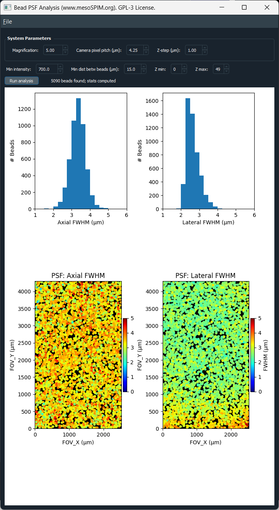

Bead PSF Analysis
==================

The **Bead PSF Analysis** tool detects fluorescent beads in a 3D z-stack,
fits a 1D Gaussian profile along each bead's axial and lateral directions,
and reports the resulting full-width-at-half-maximum (FWHM) — a common
proxy for the microscope's point spread function (PSF) — as histograms and
as spatial maps across the field of view.

It ships as a single, self-contained module
(``mesoSPIM/src/utils/psf_gui_qt.py``) and can be launched either from inside
mesoSPIM-control or as a standalone application.

   Bead PSF Analysis window: system parameters and analysis controls (top),
   axial/lateral FWHM histograms (middle), and FWHM maps across the field of
   view, overlaid on the bead max-projection (bottom).

Launching the tool
-------------------

From mesoSPIM-control
~~~~~~~~~~~~~~~~~~~~~~

Open **Utils → PSF (beads) analysis from a stack** in the Main window. A
dialog lets you choose between:

* **Last acquired stack** — re-reads the most recently completed
  acquisition's TIFF file from disk and preloads it directly. Magnification
  is parsed from that acquisition's zoom setting, and camera pixel size and
  Z-step are read from the active configuration and acquisition list, so the
  **System Parameters** fields are filled in automatically.
* **Browse for TIFF file...** — opens the tool with no stack loaded; use its
  own **File → Open TIF...** to pick any z-stack. Magnification is prefilled
  from the microscope's current live zoom setting; other parameters may need
  manual adjustment.

As a standalone application
~~~~~~~~~~~~~~~~~~~~~~~~~~~~~

The tool has no dependency on the rest of mesoSPIM-control and can be run
directly, e.g. to analyze a bead stack acquired on a different system:

.. code-block:: bash

   python mesoSPIM/src/utils/psf_gui_qt.py

Then use **File → Open TIF...** to load a 3D TIFF stack.

System Parameters
-------------------

.. list-table::
   :widths: 25 75
   :header-rows: 1

   * - Field
     - Meaning
   * - **Magnification**
     - Effective system magnification.
   * - **Camera pixel pitch (µm)**
     - Physical camera sensor pixel size. Combined with magnification, this
       gives the lateral pixel size used for FOV and FWHM calculations.
   * - **Z-step (µm)**
     - Spacing between planes in the loaded stack, used for the axial FWHM
       calculation.

All three fields are editable at any time; changing one immediately
recalculates the field-of-view scale and refreshes existing plots.

Analysis controls
-------------------

.. list-table::
   :widths: 25 75
   :header-rows: 1

   * - Control
     - Meaning
   * - **Min intensity**
     - Peak intensity threshold for bead detection: candidate beads below
       this value (after Gaussian smoothing) are ignored.
   * - **Min dist betw beads (µm)**
     - Minimum allowed separation between detected beads, also used to size
       the fitting window around each bead. Beads closer than this to
       another bead, or to the image edge, are excluded.
   * - **Z min / Z max**
     - Restricts the analysis to a sub-range of planes in the loaded stack.

Click **Run analysis** to detect beads and fit their PSF. The status label
reports how many beads were found.

.. tip::

   If very few or no beads are found, lower **Min intensity**; if beads
   merge into single detections, increase **Min dist betw beads**.

.. warning::

   Saturated pixels make the Gaussian fit unreliable. A warning dialog
   appears on load if the stack contains saturated pixels for its data type.

Results
---------

* **Histograms** (top row) show the distribution of axial and lateral FWHM
  across all detected beads.
* **FWHM maps** (bottom row) overlay each bead's FWHM, as a colored dot at
  its field-of-view position, on the smoothed max-projection of the stack.
  Axial FWHM is shown on the left, lateral FWHM on the right.

Use these maps to spot field-dependent aberrations (e.g. the PSF broadening
towards the edges of the field of view) rather than just a single
system-wide average.

Saving results
----------------

From the **File** menu:

.. list-table::
   :widths: 35 65
   :header-rows: 1

   * - Menu item
     - Output
   * - **Save stats as TXT...**
     - Summary statistics (bead count, median/min/max axial and lateral
       FWHM).
   * - **Save stats as CSV...**
     - Per-bead table (position, max intensity, axial/lateral FWHM).
   * - **Save figure as PNG (300 DPI)...**
     - The full histogram + FWHM-map figure, at a fixed 12×9 in canvas.
   * - **Save average PSF as TIF...**
     - A peak-normalized, bead-centered sub-volume averaged across all
       detected beads (beads too close to the image edge are skipped) —
       useful as a single representative PSF, e.g. for deconvolution.

Scope
-------

This tool is meant for **isolated fluorescent bead calibration stacks**
(e.g. sub-resolution bead samples used for PSF characterization), not for
general specimen data — bead detection and single-Gaussian fitting assume
sparse, well-separated point sources.
