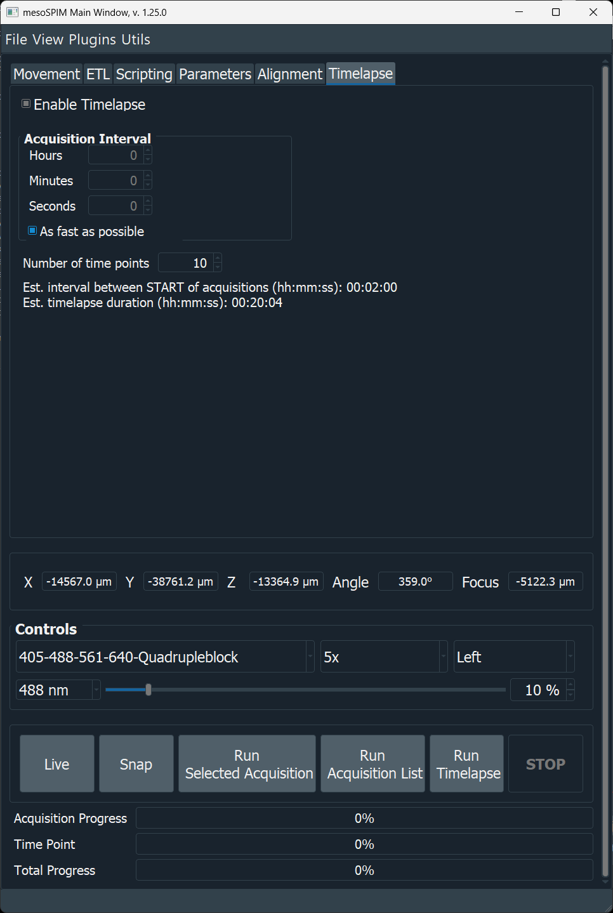

Time-lapse Acquisitions
========================

The **Timelapse** tab in the Main window repeats the current acquisition list
at defined time points, without having to write a script. Each time point
runs the exact same acquisition list configured in the Acquisition Manager.

   The Timelapse tab: Acquisition Interval, number of time points, and the
   live estimate label.

.. tip::

   Build and test your acquisition list first with **Run Acquisition List**
   (a single time point). Once the timing and output look right, switch to
   the Timelapse tab to repeat it automatically.

Configuring a time-lapse
-------------------------

1. Build the acquisition list in the Acquisition Manager as usual (position,
   channels, Z-stack range, image writer, filenames).
2. Open the **Timelapse** tab and check **Enable Timelapse**. This only
   enables the **Run Timelapse** button — it does not change how any other
   acquisition mode behaves.
3. Set the **Acquisition Interval** (Hours / Minutes / Seconds), or check
   **As fast as possible** to skip waiting between time points entirely (the
   Hours/Minutes/Seconds spin boxes are disabled while this is checked).
4. Set the **Number of time points**.
5. Click **Run Timelapse**.

.. warning::

   Time-lapse acquisitions have only been tested with the ``Tiff_Writer`` /
   ``Big_Tiff_Writer`` image writers (one TIFF stack per row in the
   `Acquisition Manager` window, via the ``_TimeNNN`` filename tag described
   below). Acquisitions with multiple stacks (channels and/or tiles) are
   natively supported, each stack is written in its own TIFF file with the
   ``_TimeNNN`` tag. OME-ZARR and HDF5/BigDataViewer output are *not yet*
   supported for time-lapses — those writers are built around a single
   container per acquisition list and are not confirmed to handle being
   re-opened and re-written once per time point.

.. important::

   The Acquisition Interval is the wait time **between the end of one
   acquisition and the start of the next** — not between the start times of
   two consecutive acquisitions. The next time point never starts before the
   previous one has fully finished, so with a short interval (or **As fast as
   possible**, which uses a zero-length interval) the real time between the
   *start* of consecutive acquisitions is approximately the interval plus the
   duration of one acquisition, not the interval alone.

What happens at each time point
--------------------------------

For every time point, mesoSPIM:

1. Appends a zero-padded ``_TimeNNN`` tag to every filename in the
   acquisition list (e.g. ``sample_Time000.tiff``, ``sample_Time001.tiff``,
   ...), replacing any ``_TimeNNN`` tag left over from a previous run so
   filenames don't keep growing.
2. Runs the full acquisition list exactly like **Run Acquisition List**.
3. Once finished, waits for the configured Acquisition Interval (skipped
   entirely if **As fast as possible** is checked).
4. Starts the next time point, until the configured number of time points is
   reached or **Stop** is pressed.

Clicking **Stop** aborts the acquisition currently in progress and cancels
all remaining time points; no partially-started time point is left waiting.

Estimated interval and duration
---------------------------------

Below **Number of time points**, a label shows two live estimates, refreshed
every 2 seconds:

* **Estimated interval between START of consecutive acquisitions** — the
  configured Acquisition Interval *plus* the predicted duration of one
  acquisition list. This is the real spacing between the start of one time
  point and the start of the next, as clarified above.
* **Estimated timelapse duration** — the total time for the entire sequence:
  ``time points × (one acquisition's duration) + (time points − 1) × interval``.

Both estimates are derived from the Acquisition Manager's predicted
acquisition time (shown next to the acquisition list, and based on the
measured or configured camera frame rate — see ``average_frame_rate`` in
:doc:`configuration`). They update automatically whenever you edit the
acquisition list, the number of time points, or the interval settings, and
become more accurate once real acquisitions have run and the measured frame
rate is known.

.. note::

   These are estimates, not guarantees. Actual timing also depends on stage
   moves, filter/zoom changes between time points, and processing/writing
   overhead, none of which are included in the frame-rate-based prediction.

Progress during a run
-----------------------

Three progress indicators are active during a time-lapse run:

.. list-table::
   :widths: 25 75
   :header-rows: 1

   * - Indicator
     - Meaning
   * - **Acquisition Progress**
     - Progress of the single Z-stack currently being acquired.
   * - **Time Point**
     - Which time point is running, out of the total configured.
   * - **Total Progress**
     - Progress across the *entire* time-lapse. Its "Remaining" estimate
       combines the measured remaining time of the current acquisition with
       the modeled duration (acquisition + interval) of every time point
       still to come — the same model used for the tab's duration estimate,
       so the two should stay consistent with each other.

The status bar also shows **"Waiting for next time point to start"** after an
acquisition finishes, whenever more time points remain.

Scripting alternative
------------------------

Time-lapses can also be started from the :doc:`Script window <user_guide>`
by calling the same underlying method directly:

.. code-block:: python

   TIME_INTERVAL_SEC = 2 * 60  # every 2 minutes
   N_TIMEPOINTS = 3
   self.run_time_lapse(tpoints=N_TIMEPOINTS, time_interval_sec=TIME_INTERVAL_SEC)

.. figure:: ../../docs/screenshots/timelapse-launch.png
   :alt: Time-lapse launched from the Script window
   :width: 60%

   Starting a time-lapse from a script (pre-dates the Timelapse tab, but the
   underlying scheduling is the same).

This is useful if the time-lapse needs to be combined with other custom
logic (e.g. changing acquisition parameters between time points), but for a
plain repeated acquisition list, the Timelapse tab is simpler and shows live
progress and estimates.
