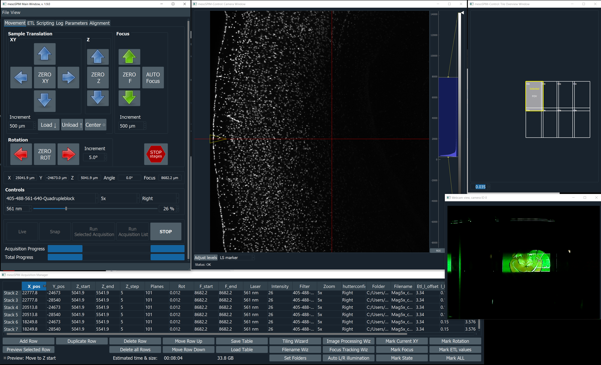
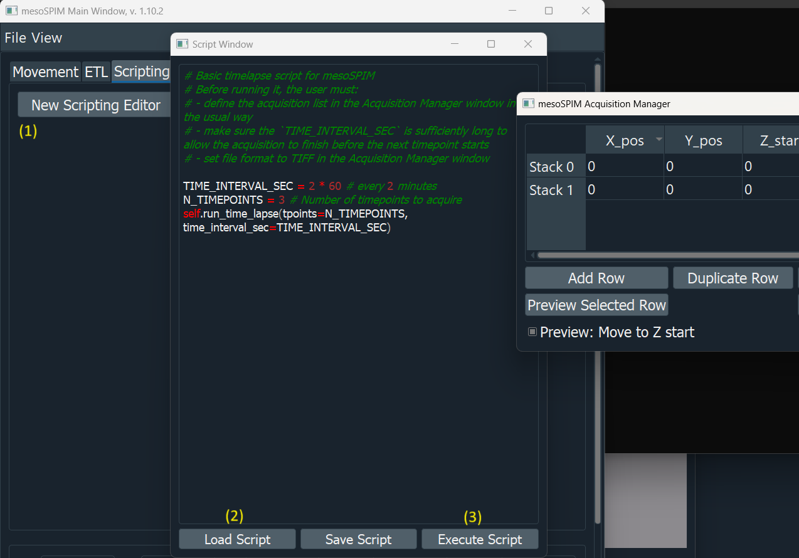

User Guide
==========

This guide walks you through the mesoSPIM-control GUI and its core workflows —
from moving a sample to running a fully automated tiled acquisition.

Overview of the interface
--------------------------

   **mesoSPIM-control v1.9** — Main window (left), Camera live view (centre),
   and Acquisition Manager (right).

The application has five main windows:

.. list-table::
   :widths: 25 75
   :header-rows: 1

   * - Window
     - Purpose
   * - **Main window**
     - Stage position read-out, manual motion controls, laser/shutter
       selection, and single-image snap.
   * - **Camera window**
     - Live camera preview with auto-range intensity scaling.
   * - **Acquisition Manager**
     - Build, edit, and run multi-position / multi-channel acquisition lists.
   * - **Tile overview window**
     - Overview of tile positions and overlaps.
   * - **Webcam window**
     - Optional USB webcam feed for sample monitoring (configurable in
       ``ui_options``).

Main window
-----------

Stage controls
~~~~~~~~~~~~~~

The ``X / Y / Z / F / θ`` buttons move the corresponding axis by the step
size shown in the adjacent spin box.  Button polarity and step-motion delays
are configurable in the :doc:`configuration` file (``flip_XYZFT_button_polarity``,
``button_sleep_ms_xyzft``).

.. note::

   The **F axis** controls the focus/objective position.  If your setup uses a
   revolving objective turret, set ``enable_f_zero_button: False`` in the
   config to prevent accidental mechanical conflicts.

Shutter and laser selection
~~~~~~~~~~~~~~~~~~~~~~~~~~~

* Use the **shutter drop-down** to choose Left, Right, or Both illumination
  arms.
* Select the active **laser** from the wavelength drop-down.  Only lasers
  listed in ``laserdict`` will appear.

Camera window
-------------

The live view updates continuously when a laser and shutter are open.
Right-click the histogram to set intensity levels; the **Auto** button fits
the display to the current frame.

Acquisition Manager
-------------------

Building an acquisition list
~~~~~~~~~~~~~~~~~~~~~~~~~~~~~

Each row in the Acquisition Manager table represents one
**acquisition entry** — a combination of position (X, Y, Z, F, θ),
illumination (laser, filter, shutter), and file settings.

Common workflow:

1. Move the sample to the desired start position using the Main window.
2. Select the laser, shutter, filter settings for the acquisition entry.  The live view
   will update to reflect the current settings, so you can preview before
   acquiring.
3. Click **Add Row** to create a new entry in the Acquisition Manager, or use the first entry to overwrite it.
4. Click **Mark ALL** to copy the current stage coordinates and light-sheet settings to the entry.  Alternatively, use the **Mark ..** buttons to mark individual parameters (eg XY position).
5. Click small **M** button next to **Z start / Z end / Z step** values to mark the positions and step for a Z-stack. Small **M** button appears always on the right side of the cell that is being manipulated.
6. Choose the **laser**, **filter**, and **shutter** arm.
7. Enter the **filename** using the **Filename Wizard**.
8. Repeat for additional positions or channels.
9. For a tiled (mosaic) acquisition, use the **Tiling Wizard** to populate the Acquisition Manager.

Acquisition modes
~~~~~~~~~~~~~~~~~

.. list-table::
   :widths: 30 70
   :header-rows: 1

   * - Mode
     - Description
   * - **Live**
     - Live mode (preview).
   * - **Snap**
     - Single image with current settings.
   * - **Run selected acquisition**
     - Sweeps the sample from *Z start* to *Z end* in *Z step* increments while illuminating with the light-sheet, using the stage coordinates and light-sheet settings from the Acquisition Manager entry.
   * - **Run Run Acquisition list**
     - Takes all stacks defined in the Acquisition Manager sequentially; this can combine multiple XY positions into a mosaic (see the **Tile Overview window** to plan overlap) and loop through multiple channels and illumination settings.
   * - **Time-lapse**
     - Experimental feature that can be triggered via scripting window that repeats the entire acquisition list at defined time intervals.

   Time-lapse configuration dialog.

Output file formats
~~~~~~~~~~~~~~~~~~~~

Select the image writer in the file-naming wizard:

.. list-table::
   :widths: 25 75
   :header-rows: 1

   * - Writer
     - Description
   * - ``MP_OME_Zarr_Writer``
     - Multi-process OME-ZARR writer — faster on systems with fast SSDs. Recommended for new acquisitions.
   * - ``OME_Zarr_Writer``
     - OME-ZARR 0.4 (zarr v2) with automatic multi-scale pyramid. Single-core implementation.
   * - ``H5_BDV_Writer``
     - HDF5/BigDataViewer format compatible with BigStitcher.
   * - ``Tiff_Writer``
     - Single TIFF per plane — simple and universal.
   * - ``Big_Tiff_Writer``
     - BigTIFF for stacks larger than 4 GB.
   * - ``RAW_Writer``
     - Raw 16-bit binary dump.

Running an acquisition
~~~~~~~~~~~~~~~~~~~~~~

Click **Run Acquisition List** in the Main Window to start.  Progress is shown
in the status bar and log.  To stop mid-acquisition click **Stop**.

Script window
-------------

The script window exposes the full mesoSPIM Python API.  Scripts run in the
same process and can read/write the instrument state, move stages, snap
images, and iterate over acquisition lists.

A selection of example scripts is in ``mesoSPIM/scripts/``.

Logging and troubleshooting
----------------------------

* All session output is logged to a timestamped file in ``mesoSPIM/log/``,
  e.g. ``20241210-154845.log``.
* Set ``logging_level = 'DEBUG'`` in your config for ultra-verbose output.
* For live status, watch the terminal where you launched the software.

Further resources
-----------------

* `ZMB Dozuki guides <https://zmb.dozuki.com/c/Lightsheet_microscopy#Section_MesoSPIM>`_
  — start-up, setup, and acquisition walkthroughs.
* `mesoSPIM YouTube channel <https://www.youtube.com/c/mesoSPIM>`_
* `image.sc user forum <https://forum.image.sc/tag/mesospim>`_
